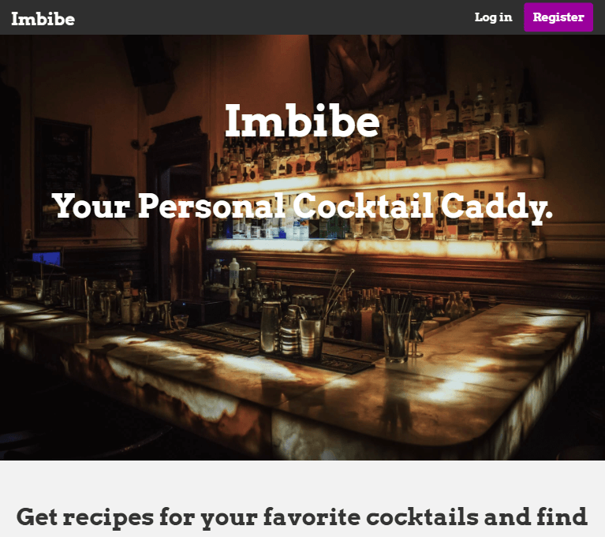
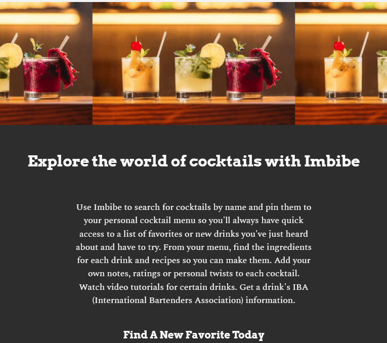
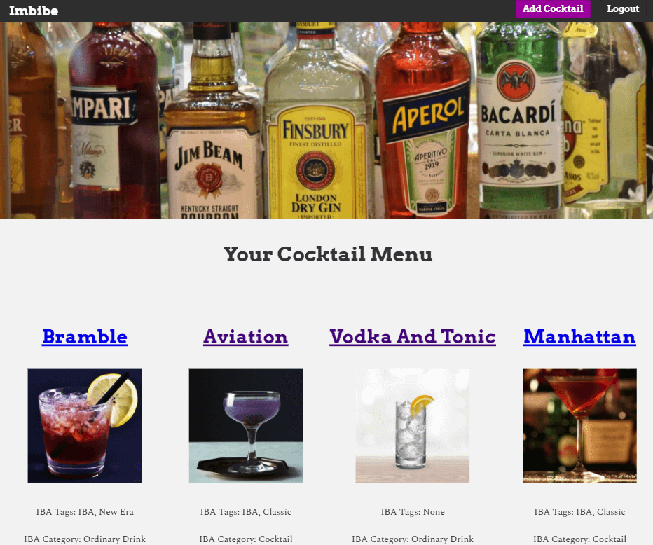
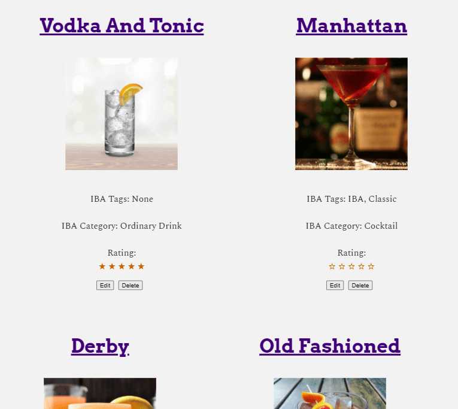
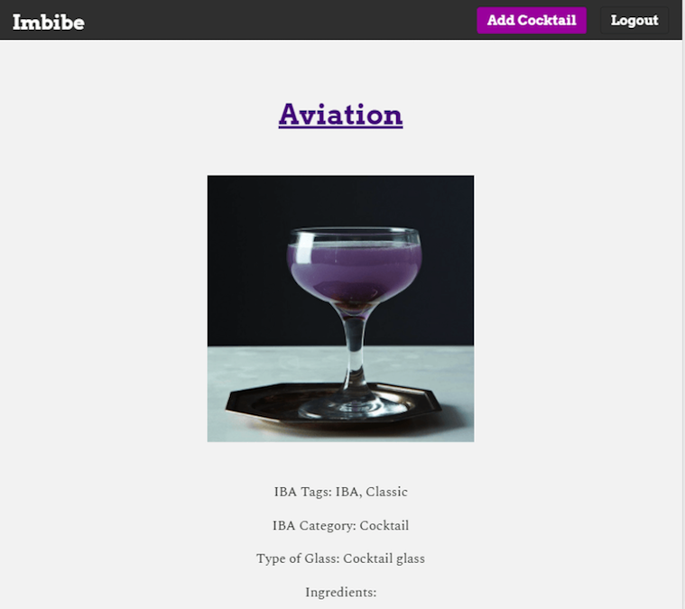
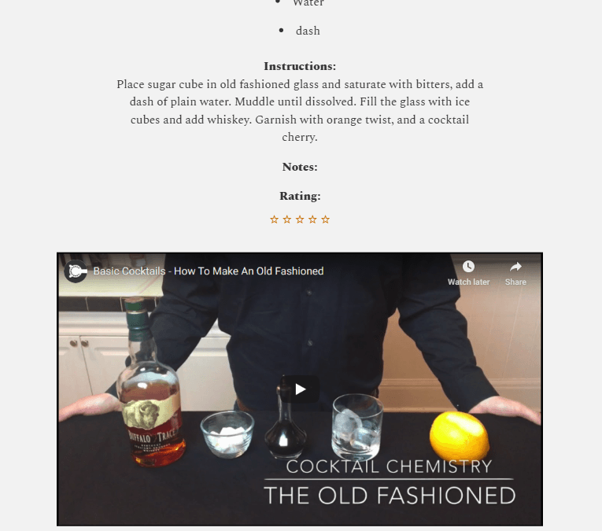
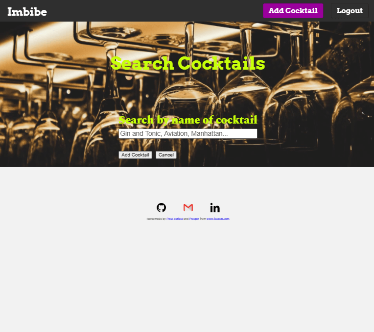

# Homely

## Summary

Imbibe gives you instantaneous information and recipes for cocktails. Each user can curate a custom drink menu of old favorites and new discoveries to try. Utilizing the Cocktail Database API to retrieve cocktail data on the Imbibe server, the user can search by cocktail name and receive a listing of ingredients, instructions, IBA (International Bartender Association) info, an image of the cocktail and, for certain drinks, a YouTube tutorial on how to mix the drink. In addition, the user can add their own personal notes and ratings for each drink.

## Live Site

- [Link](https://imbibe.vercel.app/) to view it in the browser.
- [Link](https://github.com/rogtang/imbibe-app-api) to view the API.

Upon accessing the landing page for the first time, you are on the Public Route for the site and can navigate to the Login and Registration pages. To login as a test user, use username: demo@demo.com with password: password123 and you will be taken to the Private Route and the user Dashboard. From the Dashboard, you can view all the drinks you have added to your Dashboard/menu. On the Dashboard screen, you can see the name of the cocktail, an image, IBA information and, where applicable, a user rating. To view the complete details, recipes, and notes for a specific cocktail, click on the cocktail name. You can also edit or delete a drink's recipe, notes or rating as well as search for more drinks.
NOTE: the Dashboard will only display that specific user's posts. 

## Screenshots

- Landing Page:
  
  
- Dashboard/Menu:
  
  
- Cocktail Info:
  
  
- Adding a Cocktail:
  

## Built With (Client-side):

- React.js
- JavaScript
- JSX
- CSS
- Jest (Testing)
